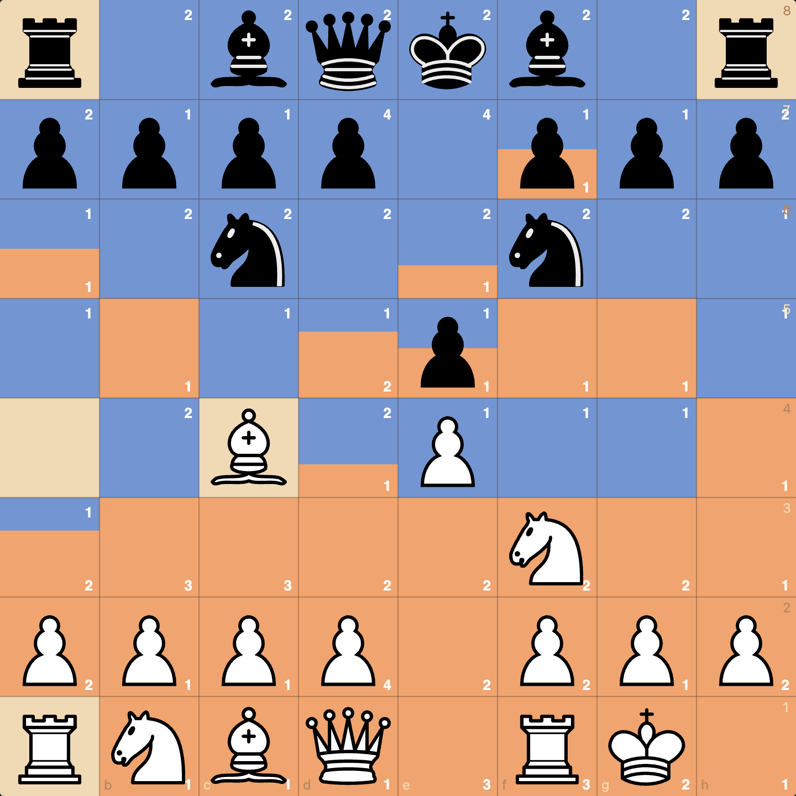
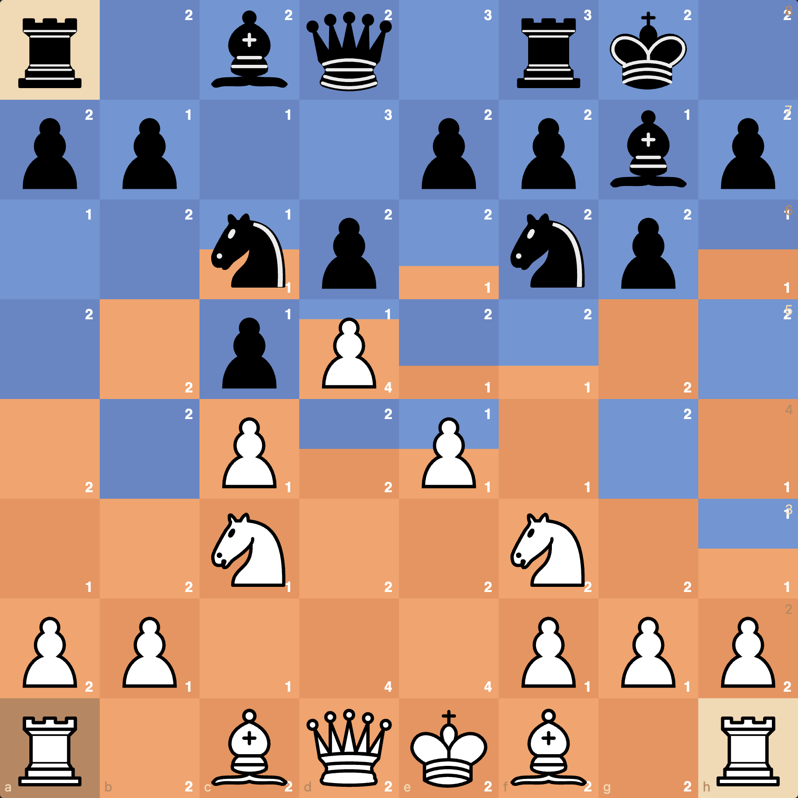
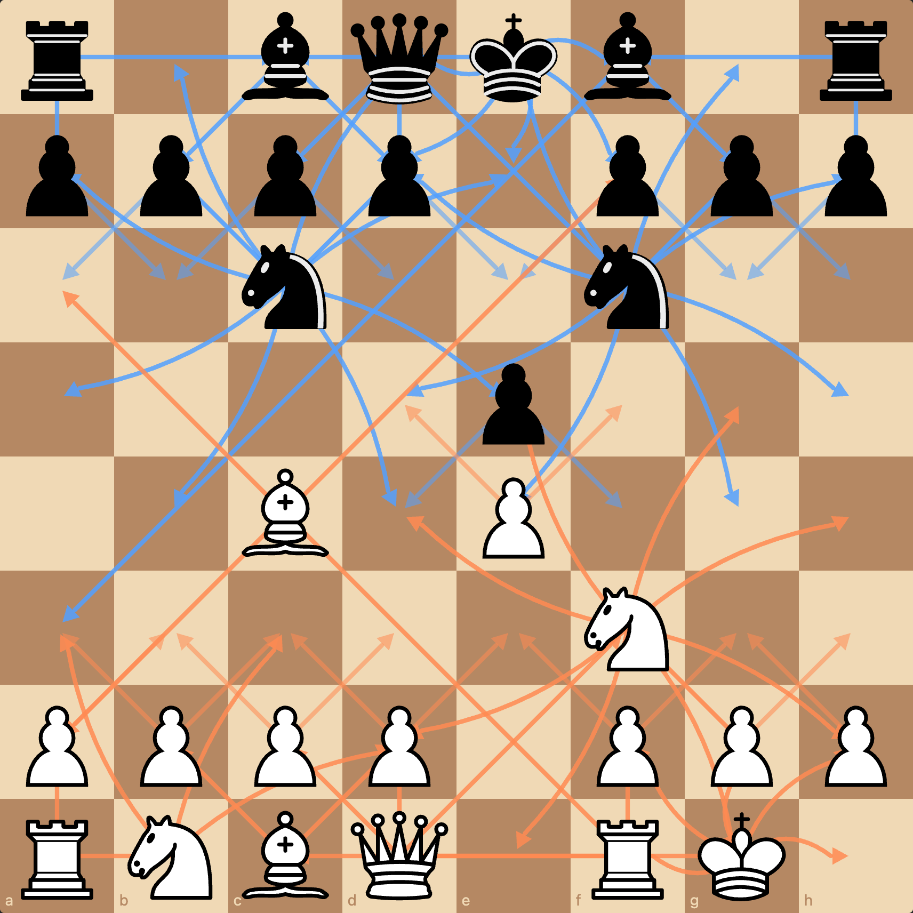
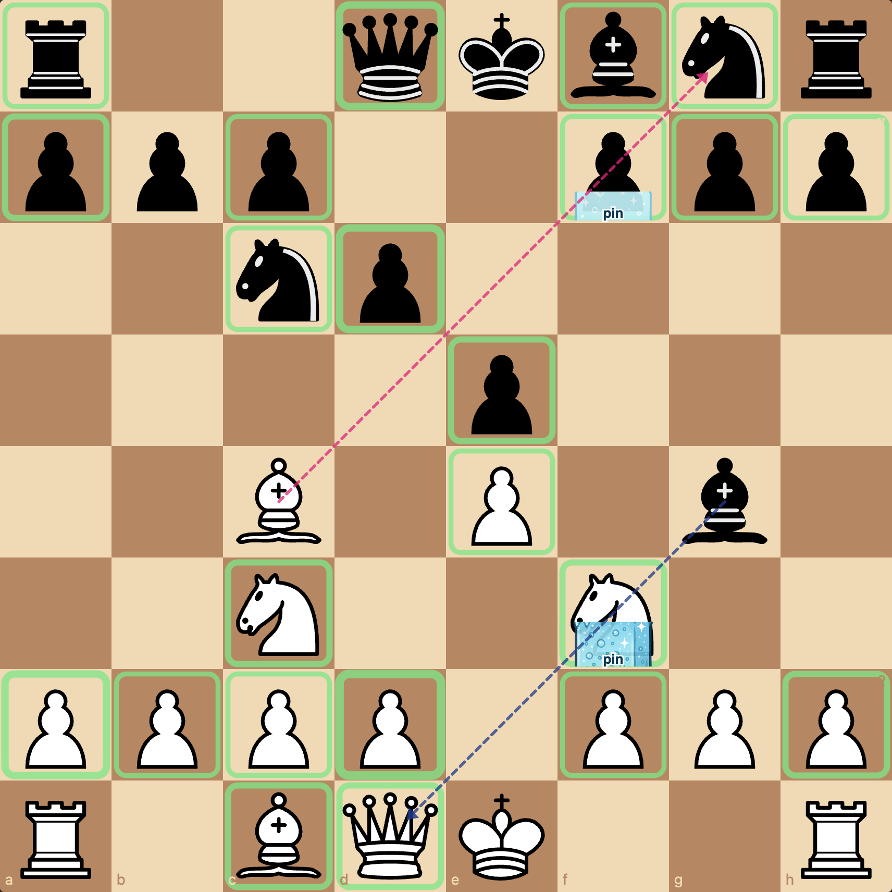
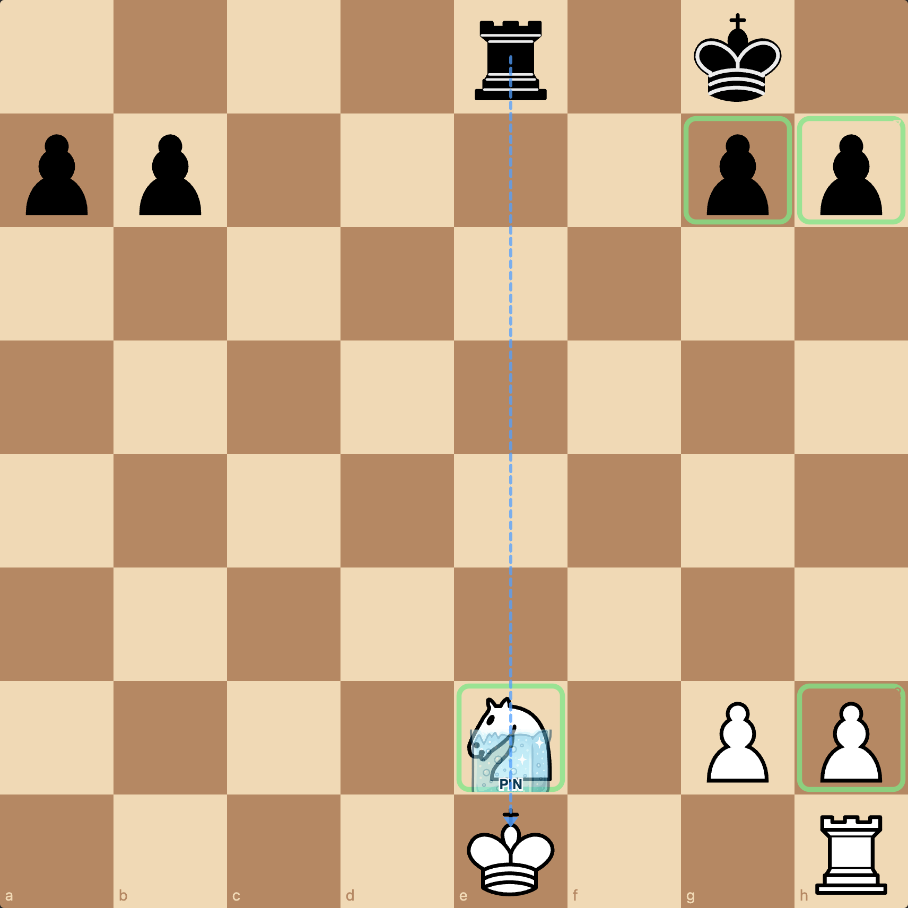
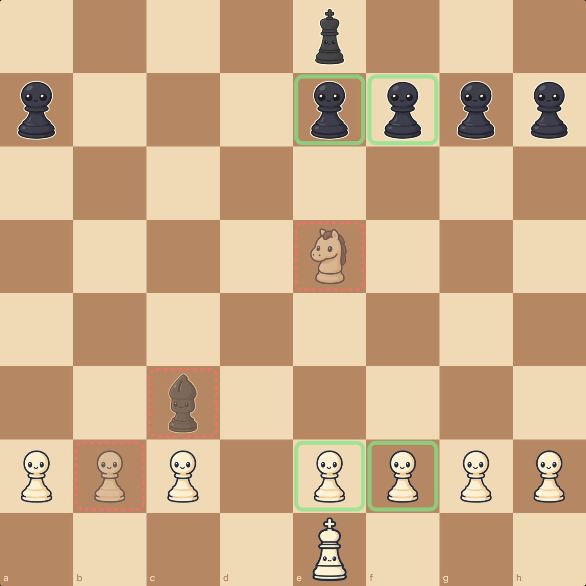
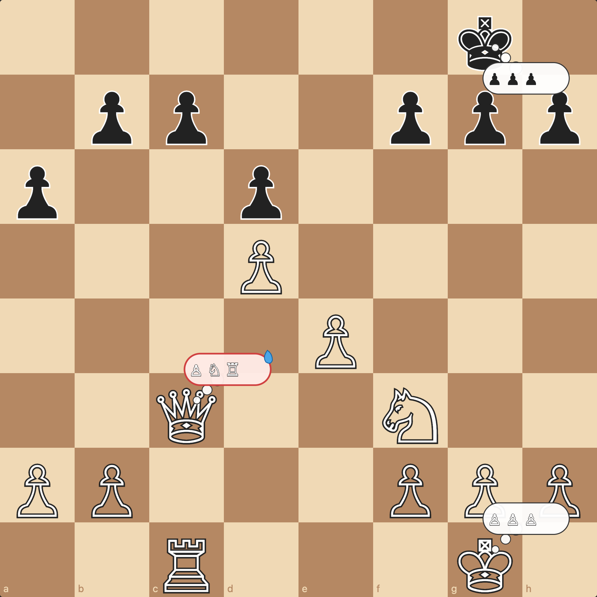
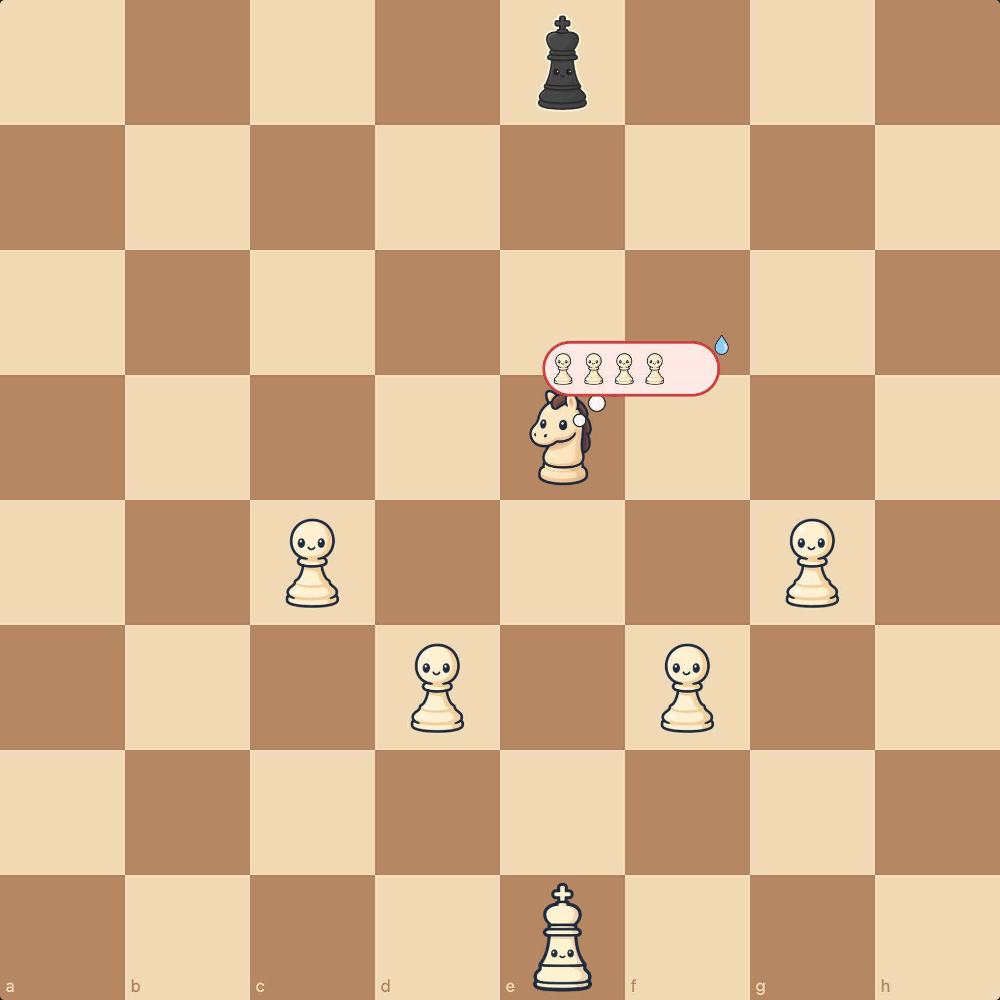

# Visual Chess — Prototype Status

This file is the single point of entry. Everything you'd want to look at is linked from here.

## The idea
Chess is a visual game, but standard boards expose almost none of the visual information beginners need to internalize: who controls what square, where attack lines run, which pieces are pinned, who is overloaded defending what. This repo prototypes four visualizations layered onto a standard board, with the goal of dropping them in front of r/chessbeginners and asking *"does seeing the board this way help?"*

## How to view

**Locally** — clone the repo and open `index.html`:
```bash
git clone git@github.com:RemiFabre/visual_chess.git
cd visual_chess
open index.html
```
No build step. ES modules + cute custom sprites.

**Live demo:** https://remifabre.github.io/visual_chess/

> Note: that `*.github.io` URL is the Pages site. The `github.com/.../blob/main/index.html` URL is GitHub's source-code viewer and will just display the HTML as plain text — not the same thing.

## Visualizations (all live, current state)

| # | Name | Status | What it shows |
|---|------|--------|---------------|
| 1 | [Controlled space](#viz-1-controlled-space) | ✅ done | Heatmap of attacker counts. Split-square triangles for contested squares. |
| 2 | [Attack paths](#viz-2-attack-paths) | ✅ done | Arrows for every attack vector; dotted continuation past the first collision for sliders; piece-specific stroke styles. |
| 3 | [Pins & protection](#viz-3-pins--protection) | ✅ done | Ice block on pinned pieces (taller block = absolute pin against the king), green rings around defended pieces, red dashed rings + fade on hanging pieces. |
| 4 | [Thought bubbles](#viz-4-thought-bubbles) | ✅ done | Each piece carries a comic bubble of what it's defending. Overloaded pieces get a red outline and a sweat drop. |

### Viz 1: Controlled space
- Each square colored by the side that attacks it. Orange = white, blue = black.
- Intensity (4 steps) tracks the number of attackers, capped at 4.
- Contested squares split into two triangles, each with its own intensity.
- Optional numeric badges in opposing corners.
- Best demo position: *King's Indian wedge* — white's central wedge is one obvious orange block.




### Viz 2: Attack paths
- Arrows from every piece to every square it threatens.
- For sliders (B/R/Q): solid line to the first collision, dotted continuation behind it (what's *behind* the blocker on the same ray).
- Piece-specific styles so overlapping lines stay readable: knight arcs are curved, queen lines are striped, kings are short dashed.
- Filter dropdowns for side and piece type.



### Viz 3: Pins & protection
- **Ice blocks** sit on pinned pieces. A full ice cube = absolute pin (against the king). A half-block = relative pin (against a more valuable piece).
- Faint dashed red line traces from the pinning attacker through the pinned piece to the piece "behind".
- **Green rings** surround pieces that are defended (thicker ring = more defenders).
- **Red dashed rings + 50% opacity** flag hanging pieces (attacked & undefended).
- King is excluded — it isn't a "defender target" and shouldn't show as protected.





### Viz 4: Thought bubbles
- Each piece "thinks about" the friendly pieces it defends — shown inside a comic-style bubble next to it.
- Bubbles grow with how much value is at stake.
- A red outlined bubble + blue sweat drop = the piece is **overloaded** (defends multiple things, total value ≥ 4).
- Mode selector to hide noise: *all defenders / 2+ defended (default) / overloaded only*.




## Sprites
Generated with OpenAI `gpt-image-1` (image gen v2) — kawaii pieces with little faces, picked deliberately to give the prototype a friendly, beginner-y vibe. 16 sprites total (12 pieces + 2 ice blocks + thought bubble + sweat drop).

To regenerate (e.g. after a prompt change):
```bash
source .venv/bin/activate
python3 scripts/generate_sprites.py            # only fills in missing files
python3 scripts/generate_sprites.py --force    # regenerate everything
python3 scripts/generate_sprites.py --piece N --color w   # one specific sprite
```
After regenerating, the PNGs are 1024×1024 (~1.5 MB each). I run `sips -Z 384 sprites/*.png` to bring the bundle from 23 MB to 1.5 MB — visually identical at our 90 px squares.

## Curated demo positions
See `js/positions.js`. Nine positions, intentionally varied:
- Starting / Italian middlegame / King's Indian wedge — for the heatmap.
- Légal trap & QGD Bg5 — relative pins.
- Open e-file knight — absolute pin.
- Hanging white knight — for the protection viz.
- Overloaded queen & knight-defends-four — for thought bubbles.

## Open questions for the user
- (none right now — see *Future ideas* below)

## Future ideas (not yet built — propose / discuss)
- **Hover / click a piece to isolate its viz** — current viz2 in the opening position has too many arrows; click one piece to see only its lines.
- **Diff against previous move** — fade old control map and overlay the new one so the player sees *what changed* after a move. Could be uniquely useful for tactical positions.
- **"What if?" preview** — drag a piece to a hypothetical square and recompute the four visualizations live.
- **Static Exchange Evaluation tint** — color the hanging-piece red ring brighter when the exchange actually loses material (vs. piece is defended but exchange still wins).
- **Threat squares** — a fifth viz that highlights any square where the opponent has a winning capture available on their next move (i.e. squares where one of *my* pieces is in immediate, unsafe attack).

## Commit log
Run `git log --oneline` for the full picture. Each milestone has its own commit and the repo is public — see https://github.com/RemiFabre/visual_chess.
